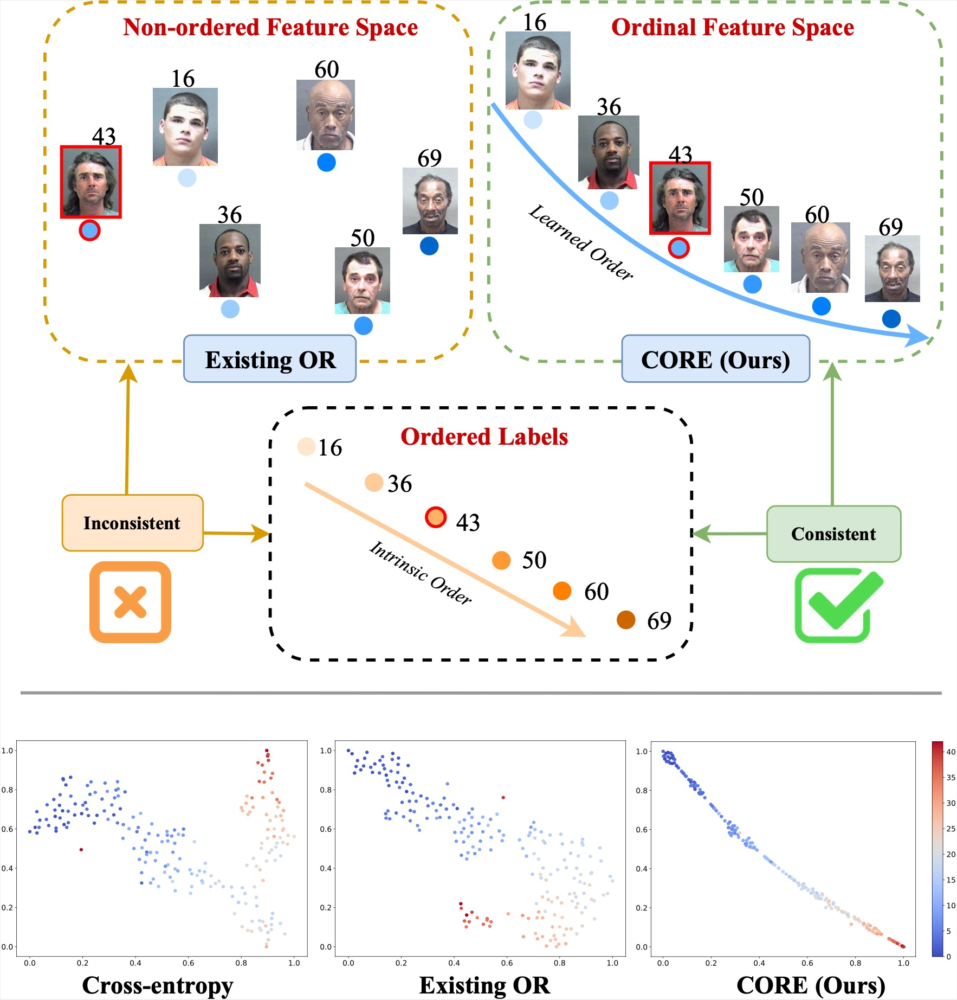
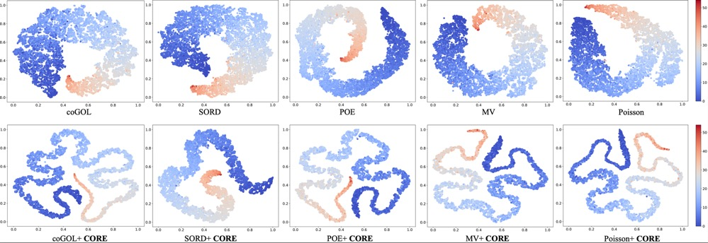
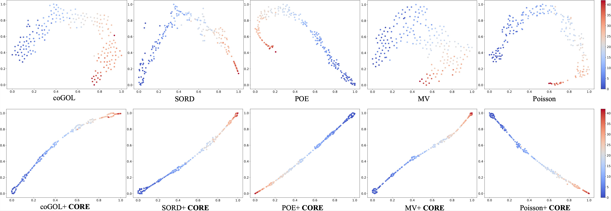

# CORE-Ordinal-Regression
Implementation of the paper "**CORE: Learning Consistent Ordinal Representations with Convex Optimization for Image Ordinal Estimation**", Pattern Recognition, 2024.

## Motivation
Motivation of learning Consistent Ordinal REpresentations:



## Usage
First, make your own Dataset, and then
```
bash run-train.sh
```

## t-SNE Results
Learned feature space of baselines and baselines + CORE. We show the t-SNE results on the test set of MORPH:

<figure>
	<!-- <figcaption>t-SNE results on test set.</figcaption> -->
  
</figure>

Also for the MORPH test set, we randomly selected 200 samples and got the following nearly one-dimensional results, verifying our motivation.
<figure>
  
  <!-- <figcaption>t-SNE results on randomly selected 200 samples in the test set.</figcaption> -->
</figure>

